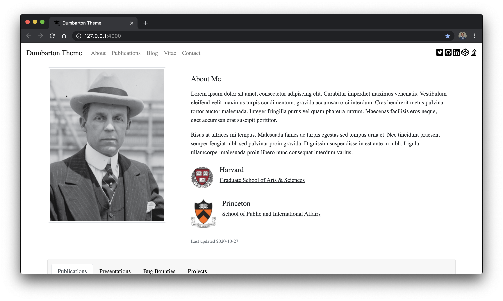

[![Contributors][contributors-shield]][contributors-url]
[![Forks][forks-shield]][forks-url]
[![Issues][issues-shield]][issues-url]
[![LinkedIn][linkedin-shield]][linkedin-url]
[](https://app.netlify.com/sites/admiring-bassi-e955ad/deploys)
  

<!-- PROJECT LOGO -->
<p align="center">
  <h1 align="center">Dumbarton</h1>
  <p align="center">
    A simple Jekyll theme for academics
    <br />
    <a href="#table-of-contents"><strong>Explore the docs »</strong></a>
    <br />
    <br />
    <a href="https://dumbarton.netlify.app/">View Demo</a>
    ·
    <a href="https://github.com/tcbutler320/Jekyll-Theme-Dumbarton/issues">Report Bug</a>
    ·
    <a href="https://github.com/tcbutler320/Jekyll-Theme-Dumbarton/issues">Request Feature</a>
  </p>
</p>

  

## Table of Contents

- [Table of Contents](#table-of-contents)
- [About](#about)
- [Installation](#installation)
- [Setting Options](#setting-options)
  - [Base  Settings](#base-settings)
  - [Site Settings](#site-settings)
  - [Blog Settings](#blog-settings)
- [Style](#style)
- [Academic Options](#academic-options)
  - [Jekyll Scholar](#jekyll-scholar)
- [Theme Options](#theme-options)
    - [Demo Theme](#demo-theme)
- [Blog Settings](#blog-settings-1)
  - [Blog Page Settings](#blog-page-settings)
  - [Favicon](#favicon)
  - [Meta Data](#meta-data)
  - [Media](#media)
- [Thanks](#thanks)

## About 
Jekyll-Theme-Dumbarton is a jekyll theme designed for academics. This theme is different from other academic themes in that it incorporates enough features to fully represent your full body of work, but still maintains a simplistic minimal weight. 

**Main Features** 

*Home Page Highlights*
  - [x] Publications 
    - Automatic bibliography formatting with jekyll-scholar 
  - [x] Coursework
  - [x] Teaching 
  - [x] Projects

*Blog*
  - [x] Wordpress-Styled Blog Page 
    - Sidebar Widgets
    - Embedded Twitter Timeline 


## Installation   

Follow the following instructions to install the Dumbarton theme  

1) Download the source code 

```bash
git clone https://github.com/tcbutler320/Jekyll-Theme-Dumbarton.git
```

2) cd into the folder 

```bash
cd Jekyll-Theme-Dumbarton
```

3) Use bundler to install dependancies

```bash
bundle install
```

4) Start the Jekyll development server

```bash
bundle exec jekyll serve
```

## Setting Options  
There are many settings available to users to change how the theme looks. These settings can be changed in `_config.yml`. It's important to note that unlike previewing changes in other areas of the site, you must stop and restart the development server in order to see changes made in the config file.  

### Base  Settings 

| _config.yml  	| Description  	| Options  	|
|---	|---	|---	|
| `image`  	| Used in metatag as sites link preview  	|  https://example.com or /assets/path/to/image.png 	|

### Site Settings 

| _config.yml  	| Description  	| Options  	|
|---	|---	|---	|
| `profile_image`  	|  Used on home page as authors profile image 	|  https://example.com or /assets/path/to/image.png  	|
| social links, ex `twitter`  	|  Used to generate links in the nav and footer 	|  ex `twitter: tbutler0x90` 	|

### Blog Settings 

| _config.yml  	| Description  	| Options  	|
|---	|---	|---	|
| `tags`  	|  Used to generate tags widget on blogs page, seperated by spaces  	| ex `tags:  post jekyll`  	|
| `comments`   | Enable comments on blog posts using gitalk. **Not Currently Working**    |  `comments: false`   |


## Style 

**Bootstrap CDN**

**Fontawesome** 

## Academic Options 

### Jekyll Scholar 
*Excerpt from [Jekyll-Scholar](https://github.com/inukshuk/jekyll-scholar)*
> Jekyll-Scholar is for all the academic bloggers out there. It is a set of extensions to Jekyll, the awesome, blog aware, static site generator; it formats your bibliographies and reading lists for the web and gives your blog posts citation super-powers.  


## Theme Options 

#### Demo Theme 

Style pallet can be found at https://colorhunt.co/palette/144191

## Blog Settings 

### Blog Page Settings   

The main blog page uses Bootstrap 4 Cards to preview individual blog posts. There are several different types of preview styles available. Set the preview by changing the frontmatter on the post *.md file in the `_posts` directory. The current available options are below.  

|   Option       |   Syntax       |  Description       |   Preview  |
|----------------|----------------|--------------------|------------|
| card-img-top  | `card-img-top`  |  Image on top      |            |
| card-dated    | `card-dated`    |  Shows Date        |            |
| card-no-img   | `card-no-img`   |  No Header Image   |            |


### Favicon 

Site favicons are located at `/assets/img/icons`. You can use a [Favicon Generator](https://realfavicongenerator.net/) to create a new set of icons using any image you'd like. Simply create a package from the aboved linked generator and replace the icons folder. 

### Meta Data 

For more information about editing the metadata used in `header.html` can be found on [htmlhead.dev](https://htmlhead.dev/)


### Media

Sample images used in the Dumbarton Demo site were found on [unsplash](https://unsplash.com/)


## Thanks 
I borrowed concepts and assets from various other open source projects. A special thanks for everyone who contributed to Jekyll-Theme-Dumbarton. 

*Code* 
+ [Masresha](https://codepen.io/masresha)
  + [Decision Making App](https://codepen.io/masresha/pen/KyLrbK): Used as a concept for the blog layout


*Images*   
Special thanks to the following indivuals for their images  
+  [Cole Keister](https://unsplash.com/@coleito)
+  [Peter Secan](https://unsplash.com/@phsecan)  
+  [Terry Boynton](https://unsplash.com/@terry_boynton)
+  [Stephen Valentin](https://unsplash.com/@valentinsteph)
+  [Laurasaman](https://unsplash.com/@laurasamang)
+  [Luke Chesser](https://unsplash.com/photos/LG8ToawE8WQ)
+  [Yancy Min](https://unsplash.com/@yancymin)
+  [Safar Safarov](https://unsplash.com/@codestorm)
+  [Emile Perron](https://unsplash.com/@emilep)


<!-- MARKDOWN LINKS AND IMAGES --->

[contributors-shield]: https://img.shields.io/github/contributors/tcbutler320/Jekyll-Theme-Dumbarton.svg?style=flat-square
[contributors-url]: https://github.com/tcbutler320/Jekyll-Theme-Dumbarton/graphs/contributors
[forks-shield]: https://img.shields.io/github/forks/tcbutler320/Jekyll-Theme-Dumbarton.svg?style=flat-square
[forks-url]: https://github.com/tcbutler320/Jekyll-Theme-Dumbarton/network/members
[stars-shield]: https://img.shields.io/github/stars/tcbutler320/Jekyll-Theme-Dumbartonsvg?style=flat-square
[stars-url]: https://github.com/tcbutler320/Jekyll-Theme-Dumbarton/stargazers
[issues-shield]: https://img.shields.io/github/issues/tcbutler320/Jekyll-Theme-Dumbarton.svg?style=flat-square
[issues-url]: https://github.com/tcbutler320/Jekyll-Theme-Dumbarton/issues
[license-shield]: https://img.shields.io/github/license/tcbutler320Jekyll-Theme-Dumbarton.svg?style=flat-square
[license-url]: https://github.com/tcbutler320/Jekyll-Theme-Dumbarton/blob/master/LICENSE.txt
[linkedin-shield]: https://img.shields.io/badge/-LinkedIn-black.svg?style=flat-square&logo=linkedin&colorB=555
[linkedin-url]: https://linkedin.com/in/tyler-b-a700a1aa
